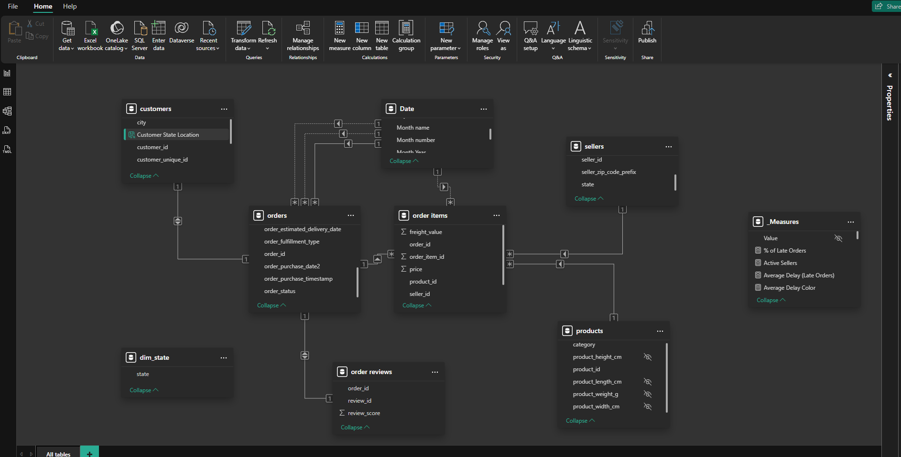
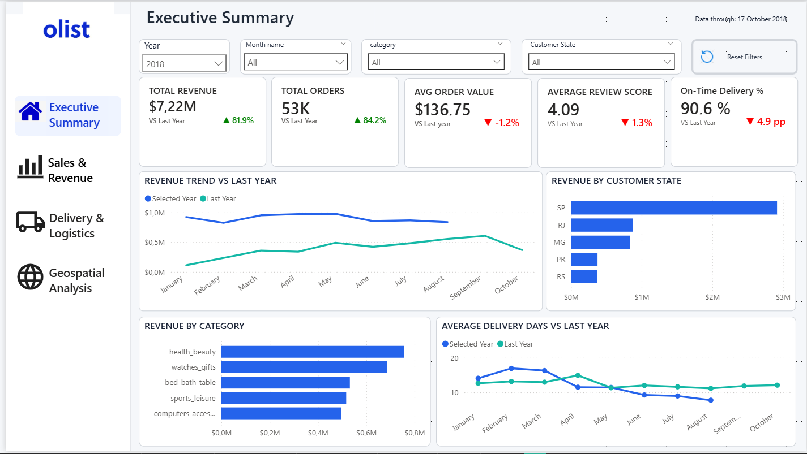
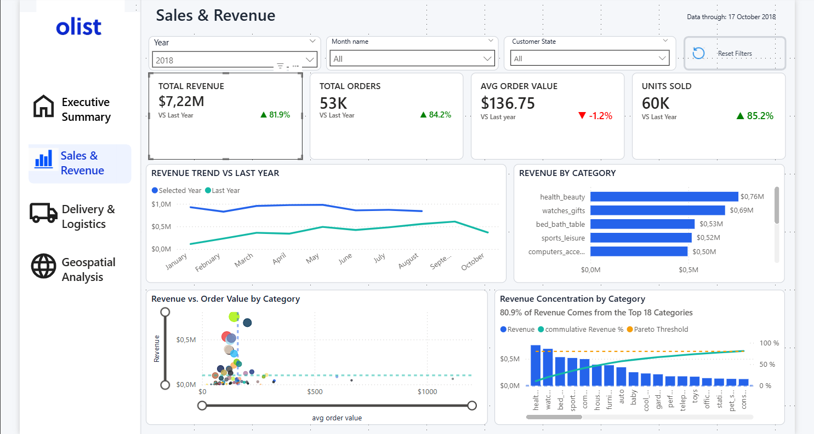

# Olist E-Commerce Analysis | Power BI

An end-to-end e-commerce data analysis project using PostgreSQL, DBeaver, Power BI, Power Query, and DAX to explore sales performance, delivery efficiency, and geographic patterns in the Brazilian Olist marketplace.

## Project Overview
This project analyzes the Brazilian Olist e-commerce dataset to evaluate sales performance, delivery efficiency, and geographic distribution.
The analysis combines SQL-based data preparation in PostgreSQL with data modeling, DAX calculations, and interactive reporting in Power BI. The final Power BI report consists of an executive overview and three focused analytical pages:

- **Executive Summary** — High-level overview of key business KPIs and trends
- **Sales & Revenue** — Sales performance, revenue trends, and product/category analysis
- **Delivery & Logistics** — Delivery efficiency, delays, and fulfillment performance
- **Geospatial Analysis** — Customer/seller distribution and geographic fulfillment patterns

## Tools and Technologies

- **PostgreSQL** — Database management, data storage, and SQL-based transformations
- **DBeaver** — SQL client used to query and manage the PostgreSQL database
- **Python (Pandas)** — Used to handle and prepare datasets that required additional processing during data import
- **Jupyter Notebook** — Environment used for Python-based data preparation and troubleshooting
- **Power BI** — Data modeling, analysis, and interactive dashboard development
- **Power Query** — Data transformation and preparation
- **DAX** — Measures, KPIs, and time-intelligence calculations

## Business Questions
The analysis was designed to answer the following business questions across four report pages.

### Executive Summary

- Is revenue growing over time?
- Are order volumes increasing?
- How satisfied are customers?
- Is delivery performance improving?
- Which regions and product categories are driving revenue?

### Sales & Revenue

- How is revenue changing over time?
- Which product categories generate the most revenue?
- Are high-revenue categories driven by higher-value purchases or greater sales volume?
- How concentrated is revenue across product categories?

### Delivery & Logistics

- How is average delivery time changing compared with the previous year?
- How efficiently and reliably are orders being fulfilled?
- How severe are delays when orders arrive late?
- How does late delivery relate to customer review scores?
- How many orders fail to result in a successful delivery?

### Geospatial Analysis

- Which Brazilian states contribute the most to revenue?
- How are customers and sellers distributed across states?
- Does the geographic distribution of Olist's seller network align with customer demand?
- What proportion of orders are fulfilled within the customer's state versus across state boundaries?
- How does cross-state fulfillment relate to delivery time, on-time performance, and delay severity?

## Data Source & Preparation

The project uses the Brazilian E-Commerce Public Dataset by Olist, which contains information about orders, customers, sellers, products, payments, reviews, and geographic locations.

### Data Ingestion

The main CSV datasets were imported into a PostgreSQL database and managed and queried through DBeaver.

The customer reviews dataset required a different ingestion approach because its text fields contained multiline content and special characters that caused issues with the standard CSV import process.

To handle this dataset, Python was used to load the CSV into a Pandas DataFrame and SQLAlchemy was used to establish a connection to PostgreSQL and write the resulting table directly to the database.

### Geolocation Data Preparation

The raw geolocation dataset contains latitude and longitude information associated with Brazilian ZIP code prefixes. However, `geolocation_zip_code_prefix` is not unique in the source data, with multiple geolocation records existing for some ZIP code prefixes.

To create a suitable lookup for geographic enrichment, a PostgreSQL view was created containing one record per ZIP code prefix.

The resulting view was then imported into Power BI and used in Power Query to enrich the customers table with geographic attributes, including latitude and longitude.

The workflow was:

Raw Geolocation Table  
↓  
PostgreSQL View with Unique ZIP Code Prefixes  
↓  
Power BI / Power Query  
↓  
Merge with Customers  
↓  
Latitude & Longitude added to Customers table

After geographic enrichment, 0.3% of customer records had unavailable latitude or longitude values. These records were retained in the analytical model. All 27 Brazilian states remained represented in the state-level geographic analysis.

After the required geographic attributes were merged into the customers table, load was disabled for the intermediate geolocation query because it was no longer required as a separate table in the Power BI data model.

### Product Category Preparation

Product categories were standardized before analysis. Portuguese category names were mapped to their English equivalents using the provided category translation table.
Approximately 2% of products had missing category information and were retained under **"Not Specified"** rather than excluded. These products accounted for approximately **1.3% of total revenue**, indicating a limited impact on category-level revenue analysis.

### Order Delivery Status Preparation

Missing delivery dates in the orders table were investigated and found to correspond primarily to orders that had not reached a delivered status, rather than representing arbitrary missing data.

A delivery-status flag was created to distinguish successfully delivered orders from non-delivered orders. This flag was subsequently used to ensure that delivery-time and delay analyses were calculated only for relevant orders.

Tables and columns used in the analytical model were renamed using clear, business-friendly naming conventions to improve readability and usability within Power BI.

### Review Data Preparation

The `order_reviews` table contained multiple review submissions for some orders. Of 99,441 orders, 547 (0.55%) had more than one review submission.

Among these duplicate submissions, 202 orders (37%) had a change in review score, while 345 (63%) retained the same score and differed only in review content.

To ensure one review score per order and reflect the customer's latest available assessment, the most recent review was retained based on the review creation date, using the answer timestamp as a tiebreaker.

A PostgreSQL view containing one retained review per order was then created and imported into Power BI for review-score analysis.

## Data Model

The prepared data was loaded into Power BI and organized into a relational model connecting orders with customers, order items, products, sellers, reviews, and a dedicated Date table.

The model was designed to support sales, delivery, and geospatial analysis, including revenue trends, product-category performance, customer and seller distribution, and order fulfillment across Brazilian states.

### Model Structure

- **Orders** — order-level and delivery information
- **Order Items** — item-level sales data
- **Customers** — customer and geographic information
- **Products** — product and category information
- **Sellers** — seller information
- **Order Reviews** — cleaned order-level review data
- **Date** — date dimension for time intelligence

  ### Disconnected State Dimension

A disconnected `dim_state` table was created from the distinct states available in the Olist geolocation dataset to support a direct comparison between customer and seller geographic distributions.

Using `customer_state` or `seller_state` directly as the visual axis would apply the filter context from only one side of the comparison. The disconnected state dimension therefore provides a common geographic axis, while DAX measures use `TREATAS` to apply the selected state context independently to the customer and seller tables.

This approach was used to compare **Customer Share by State** and **Seller Share by State** and evaluate whether Olist's seller network geographically aligns with its customer distribution.

## Power BI Report

The Power BI report consists of four interactive pages, moving from a high-level overview of business performance to focused analysis of sales, delivery, and geographic patterns.

### 1. Executive Summary

Provides a high-level view of Olist's overall business performance, combining key sales, customer satisfaction, and delivery indicators in a single page.

The page tracks revenue, order volume, average order value, review scores, and delivery performance, while highlighting revenue trends and the states and product categories contributing most to revenue.

### 2. Sales & Revenue

Focuses on revenue performance and the factors driving sales across product categories.

The page compares revenue, orders, units sold, and average order value with the equivalent prior-year period, while examining revenue trends and category performance. It also explores whether high-revenue categories are driven by higher order values and how concentrated revenue is across the product portfolio.

### 3. Delivery & Logistics
### 4. Geospatial Analysis

